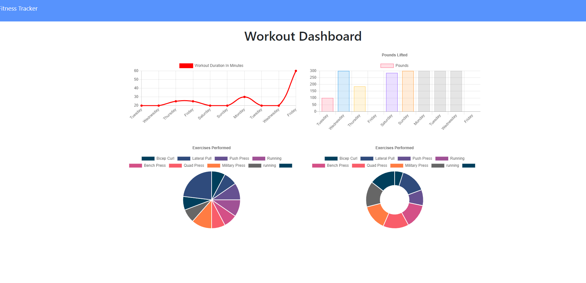
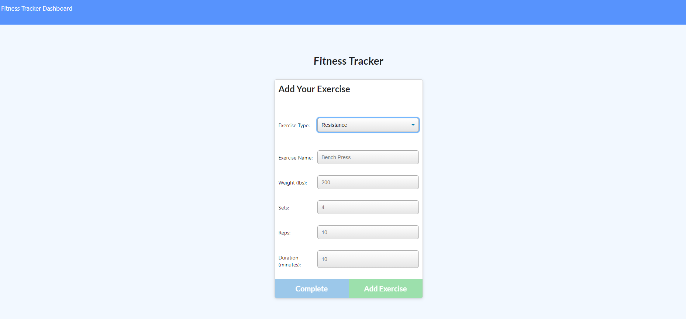

# Fitness Tracker

## Description
This application uses Express, MongoDB, and Charts.js to allow users to track and view their workout history. Users can add workouts and view previous workouts. They can also view their aggregated workouts on the stats page. 

## Table of Contents
- [Installation](#installation)
- [Usage](#usage)
- [Screenshots](#screenshots)
- [Credits](#credits)
- [License](#license)

## Installation
To run locally, the user should fork this repo and set up a database called "workout" using Mongodb. From here, the user can run npm i, npm run seed, and npm start to view and use the app. 

## Usage
To use the application, the user can choose to either add a new workout or view previous workouts by navigating through the buttons on the UI. 

Link to deployed application: 

## Screenshots

## Credits
Special shoutout to Columbia Coding Bootcamp for helping to me to make this application!

## License
MIT
